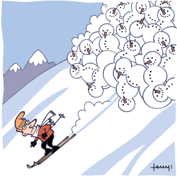

# They say it's risky, should I go?

# Abstract
*A 150 word description of the project idea, goals, dataset used. What story you would like to tell and why? What's the motivation behind your project?*

Risk zero does not exist in alpinism. Statistical models have been developed to assess this risk but they do not prevent tragedies. We do not claim that we can do better, but given that most of the accidents are due to bad people decisions, we are convinced that raising concern about the past mountaineering accidents can strongly improve alpinists' judgement in the future. The aim of this project is to gather meteorological and environmental data (weather condition, precipitations, snowpack, wind, temperatures, slopes, exposures, time of day…) along with avalanche cases and casualties. By leveraging interactive visualization means, we will provide the skiers ways to understand the conditions of previous cases and maybe hints that could have changed the outcome. We will focus on the Swiss and French Alps.

# Research questions
*A list of research questions you would like to address during the project.*

- What is the influence of weather conditions on past avalanche cases?
- How can we evaluate individuals' decisions when exposed to snow and avalanche risk report but still want to ride?
- What is the best way to visualize the 10 days of snow/weather conditions before an avalanche case? 
- Is there any unexpected correlation that current statistical models do not capture?
- Are avalanche accidents more fatal with a risk level of 3 than with a risk level of 5? Or just more frequent? Is there a survival bias?

# Dataset
*List the dataset(s) you want to use, and some ideas on how do you expect to get, manage, process and enrich it/them. Show us you've read the docs and some examples, and you've a clear idea on what to expect. Discuss data size and format if relevant.*

To conduct out studies we will need to cross two type of datasets:

#### Avalanche report datasets

- [data-avalanche.org](http://www.data-avalanche.org/list) **Alps (not only Switzerland)** is a dataset gathering avalanches information such as the location, the characteristic, the date, the type of snow and the danger of avalanches recorded in both France and Switzerland. Snow maps are available as well.
- The [*Institute for Snow and Avalanche Research* (SLF)](https://www.slf.ch/en/avalanches/destructive-avalanches-and-avalanche-accidents/avalanche-accidents-of-the-past-20-years.html) provides tables and maps of the fatal avalanche accidents of the past 20 years in Switzerland. It includes geolocation, 

#### Meteorological dataset

- Swiss data portal [meteo suisse](http://www.meteoschweiz.admin.ch/home/wetter/messwerte/messwerte-an-stationen.html?param=temperature) gathers meteorological and environmental data: weather condition, precipitations, snowpack, wind, temperatures in Switzerland.
- [historic meteo](http://www.historique-meteo.net/europe/suisse/)

- ​

[envidat](http://www.envidat.ch/dataset?q=snow) pb pcq est en maintenance

*News-related dataset*:

Avalanches being frequently deadly, newspapers release articles regarding them indicating their location, their strength and wether or not people were injured. These data can be set aside to the avalanche related information and used as collateral information to enrich our dataset. For that purpose, some datasets you provided can be useful:

- [Swiss Open Data](https://opendata.swiss/en/)
- [200 years news (Le Temps)](http://www.letempsarchives.ch/) along with [News On the Web](https://www.corpusdata.org/intro.asp)

- Swiss tweets dataset (if some of them contain information about either the weather or avalanches declared, the time range will be a key aspect as most of the news collected from twitter will be recent)

We are aware that using external datasets is risky. But we are very motivated to achieve this analysis. We think that the plan we propose is feasible and fits well the project theme: "data science for social good". 

We think that building our own dataset will help us getting familiar with our environment of study. Crossing information coming from more than one website will improve the accuracy of the statements made in the end. 

The main challenge of that project will be to collect all of the necessary information so as to avoid bias in our obtained results. 

It is indeed difficult for now to annouce the size of our data set as we will cross information while collecting it. 

#### Risk assesment of our datasets

In case Swiss avalanches data has a low temporal/spatial resolution to visualize patterns, we might pivot to the United States data. The [Colorado Avalanche Center](http://avalanche.state.co.us/accidents/us/) has detailed reports of every avalanche casualties in the last 8 years.*

# A list of internal milestones up until project milestone 2
Add here a sketch of your planning for the next project milestone.

- Data fetching: meteorological data, news parsing for past avalanche cases, investigate Rega or PGHM database (if public).
- Extend dataset if some information results in being too poorly helpful.
- Build clean dataframes from collected data.

# Questions for TAs
*Add here some questions you have for us, in general or project-specific.*

- Do we have to answer to a specific problematic during this project and solve a problem?

- Are we allowed to add some more datasets if we find anything interesting in the following two months that could extend our area of research and improve our results?

- If some datasets announced earlier seem to be irrelevant in the future, will we be allowed to drop them?

- ​

  ​