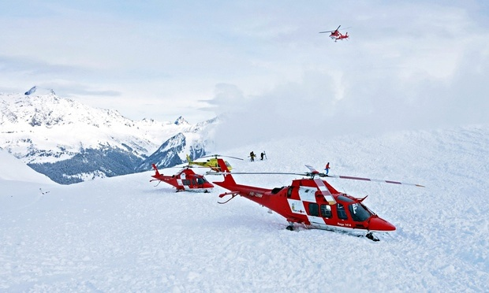

<h1>
 They say it's risky, should I go?
</h1>

In the news, who has not seen articles relating deadly avalanche accidents ?

This photo was taken after an avalanche accident that killed 5 skiers at the Piz Vilan mountain. Here is the avalanche accident information taken from our dataset:

**Date :**             2015-01-31 00:00:00  
**Canton :**                           GR  
**Starting zone :**    Seewis im Prättigau  
**Elevation :**                       2340  
**Aspect :**                              E  
**Activity :**         Backcountry touring  
**Danger level :**                       3  
**Caught :**                             8  
**Buried :**                            7  
**Killed :**                             5  
**Latitude :**                   47.0128  
**Longitude :**                   9.60505  
**Temperature :**                  -11.04  
**Wind :**                           fort   

 

- How many accidents are recensed each year ?
- Are there aspects associated with higher risks ?
- Do correlations exist between accidents and the danger levels, the activity ... ?

These questions are among the few we will try to answer by investigating avalanche accidents data.

But first, it is important to get a representation of the impact of avalanches, and their situation in Switzerland.
Let's visualize it on a map !

### Accidents evolution over time:

Knowing that an increasing number of people is skiing each year and do backcountry activity or off-piste skiing, we could suppose that the number of avalanche accidents is increasing each year. But is this true ?

There does not seem to be a significant increase in avalanche accidents along time. Even if backcountry touring and offpiste skiing have become more popular, resulting in an increase in people being at risk to be caught in avalanches, there has been an effort to prevent accidents by the authorities and make people aware of dangers they are facing, which allows to reduce risks.

### Inspecting the aspect

The aspect a slope is facing plays an important role in the creation of avalanche conditions.
In mid-winter, steep north-facing slopes are not exposed to any direct solar radiation. A south-facing slope often receives regular sunshine, especially at the end of the ski season. It is common in springtime to see naturally triggered loose snow avalanches in the middle of the day. 
 
Thus, due to sun exposition at the end of the ski season, south-facing slope could possibly be more favourable to avalanches than in the beginning or middle of winter.

That is why the evolution of aspects between the beginning, the middle and the end of season are investigated.

We can see that considering south aspect accidents, most of them are at the end of the season.

###  Off-piste skiing or Backcountry touring ?

For which activity do we see most of the accidents ?

More accidents are related to backcountry touring activity.

But in which conditions do the skiiers go on a ride, depending on their activity ?
 
Is there a class of persons that is more educated on avalanche risks ?

In order to limit avalanche risk, it is important to be aware of the destructive power of avalanches, understand when and why they happen (snow and meteorological conditions). 
One of the main factor allowing to avoid accidents is increasing the awareness of the risks. And this begins with consulting the avalanche danger level before going on a ride.

Thus, it could be interesting to study skiiers' behaviour, and see if, depending on the activity (backcountry or off-piste), one group has a tendancy to be more risky considering avalanche danger levels. 
To answer this question, we decided to count the number of accidents per danger level, considering two groups: people doing backcountry touring and people doing off-piste skiing.
 
Only danger levels 2 and 3 are taken into account in this analysis, as the other danger levels can be considered as outliers.

##### Propensity score matching:

Our hypothesis states that the behaviour of skiiers may depend on the activity they are doing.

But do draw valid conclusions, a propensity score matching is done. The matching allows to maximize the similarity between matched subjects, by balancing feature-value distributions between the two groups. 

From our results, accidents due to backcountry activity show in general reduced danger levels compared to accidents caused by off-piste skiing. This could suggest a difference of behaviour between both groups. Indeed, this result could be explained by the fact that people doing backcountry touring have a better knowledge and awareness of the risks than people doing off-piste skiing.

A student t-test confirms our first assumption.
Thus, a preventive behaviour may allow to reduce the avalanche risk.

###  Skiing alone or in group ? 

<h1>
 powder or life?
</h1>

_"But here’s the thing. When an avalanche hits and you are on your own, you may not be ok. An airbag may keep you above the avalanche debris, it may rise you to the surface but you may still be buried superficially or you may still experience trauma from hitting a tree, a rock, a cliff and then who is there to dig you out, to call emergency rescuers?
Oh, no one. Why? Because you skied or snowboarded alone." [Snowbest article](http://www.snowsbest.com/ski-or-board-off-piste-alone-dont-be-an-idiot/)_

In mountain, it is highly recommanded not to ski alone. Indeed, any mountain professional will tell you should never go off alone on a freeride. The group size should be considered so that there are enough people to affect any potential rescue. Under no circumstances should someone go off alone freeriding because there will be no one around to help him or even witness his burial.

That is why we evaluated the death rate, depending on the number of people that were caught during the avalanche accidents.

We see that the death rate decreases with the number of people caught in the avalanche. This shows that, when people are skiing in group, their survival rate increases. This favors the statement "you should never go off alone on a freeride".