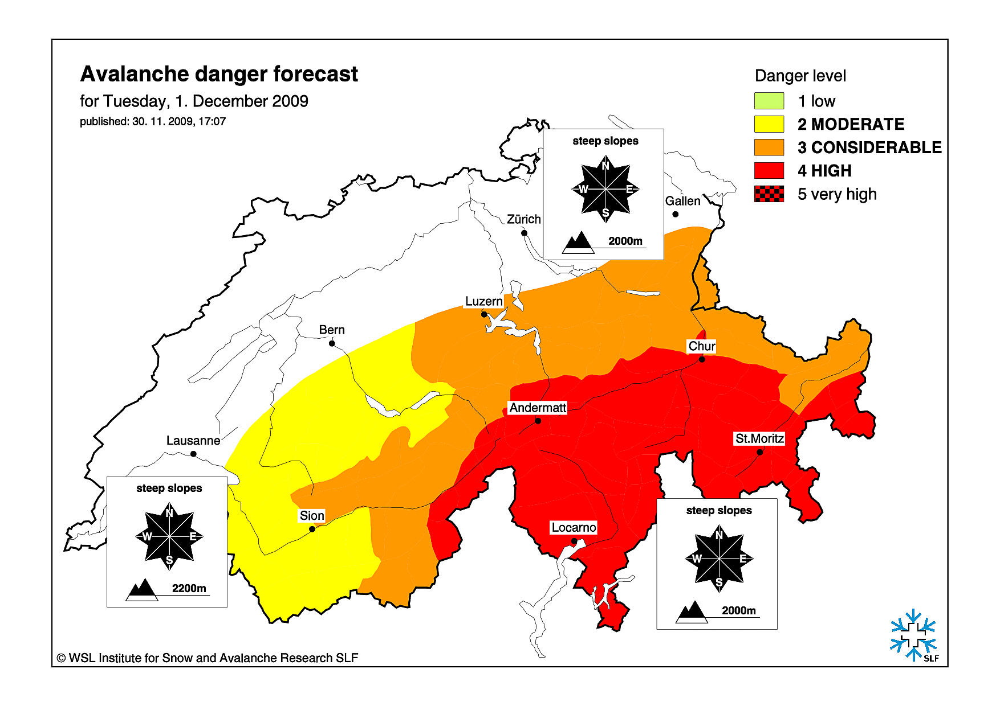
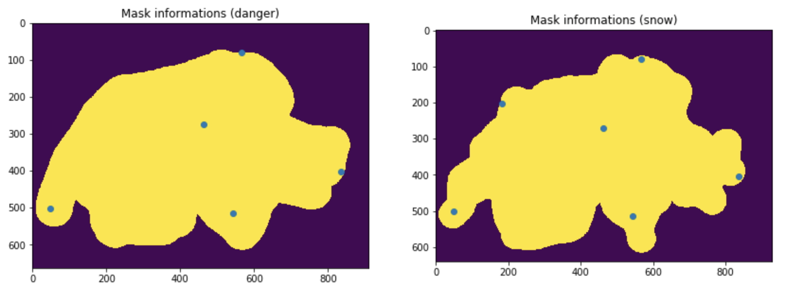
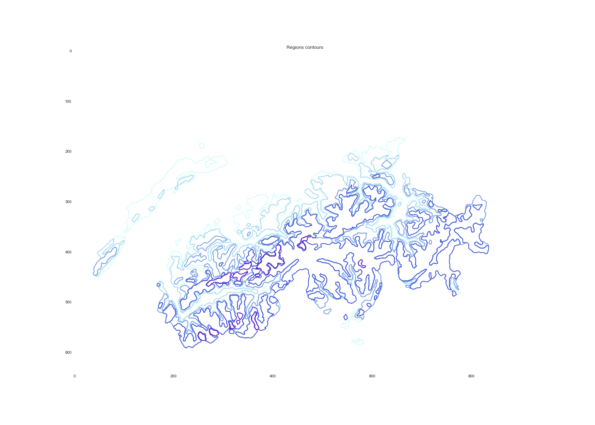
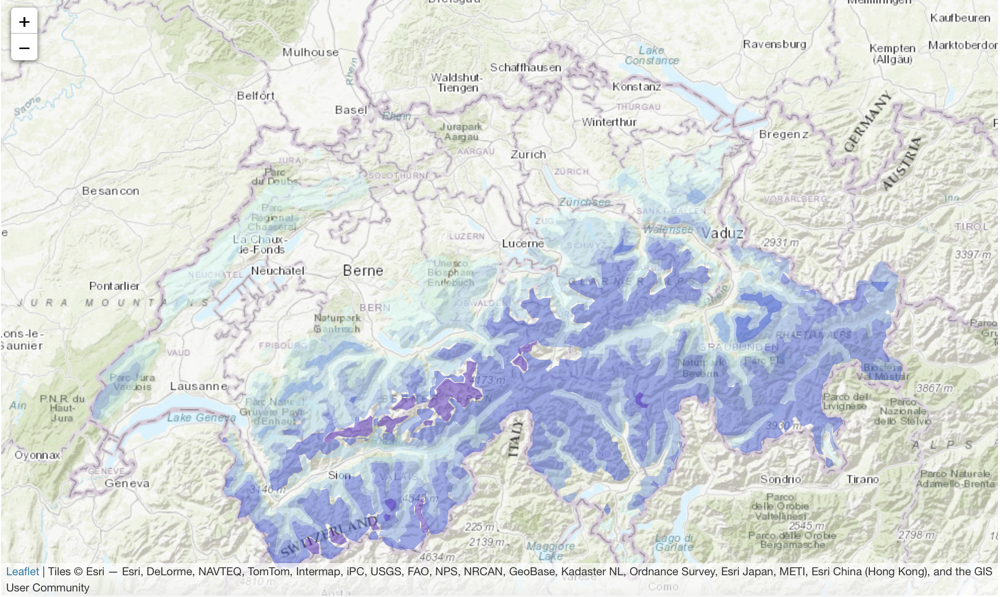

# Data extraction

#### 1 - [Data scraping](#1.-Data-scraping)

#### 2 - [Map extraction](#2.-Map-extraction)

#### 3 - [Text processing](#3.-Text-processing)

#### 4 - [Avalanches accidents](#4.-Avalanches-accidents)

## 1. Data scraping

Our dataset consists of information retrieved from [SLF archives](https://www.slf.ch/en/avalanche-bulletin-and-snow-situation/archive.html). We asked the managers to access their data base, they wouldn't let us: no problem, we scraped hard core for one night.

Several functions were useful to select the folders we wished to extract: :

- **language:** files are often duplicated for the 4 languages (de, fr, it, en). When it is the case we download only one set in the following order of preference: en - fr - de. German is the default (always present).
- **too specific:** some files are not interesting for now (too specific or too regional). We don't download the snowprofiles and the regional snow report,
- **color or black and white:** maps are available in color and in black and white. Colors are easier for computer vision algorithm, so we drop the black and white map.

Now we can use the python script `../tools/download.py` to fetch the ~30'000 files in the directory structure. 


# TODO rajouter files_to_download dans le directory data 

```
python3 tools/download.py data/file_to_download. ./data/slf --prefix https://www.slf.ch/fileadmin/user_upload/import/lwdarchiv/public/ --nproc 4
```

We got approximately 5GB of data that we store on a S3 bucket `s3://ada-avalanches`. Let us know if you want to have access. It has the same hierarchy as [SLF archives](https://www.slf.ch/en/avalanche-bulletin-and-snow-situation/archive.html)

## 2. Map extraction

The most challenging part of the data extraction was retreiving the necessary informations from images provded by the website [SLF archives](https://www.slf.ch/en/avalanche-bulletin-and-snow-situation/archive.html). 




We had to develop a handful of methods to extracts the snow/danger regions from the color maps. We applied these methods to danger maps and all kind of snow maps.

- *grey removal:* looking at standard deviation of color channels for each pixel, we could threshold the greys and remove them from the original image,
- *color projection*: due to the noise in the image or minor differences in the color tones, we had to project each pixel's color to the closest color in the reference key (with euclidean distance).
- *mask clipping*: each image having different size or how the country is centered, we had to create binary masks to remove the legend, the title and sometimes extra logos or noise.



- *smoothing*: to remove small imperfections or noisy color projections, we used a median filter in order to get smoother regions and ease the task of contour detection.





- *region detection*: using color detection we extracted the contour of each region.
- *pixel to geo location projection*: once we had contours of the regions in the image (by pixels) we had to transform those into geolocated regions. To do so, we learned a mapping from pixel to geolocations. We took 6 points  of references on the image and on Google maps (the points you can observe on both of the masks displayed above are references to project regions onto geoJSON maps). Note that 3 would have been enough to constraint the problem, but with least square solver we could average out our small mistakes at picking pixel location of the landmarks.
- *GeoJSON creation and website:* to visualize the regions, we transformed them into GeoJSON, smoothed these polygons and displayed them in a really basic HTML interface to check the consistency.



By running the python scripts `../tools/map_extractor.py` and `../tools/map_extractor_adapted2snow.py` we could automatize the extraction of maps, which ran for more than 30 hours! The 

`python3 tools/map_extractor.py data/slf/ data/map-masks/ json-maps/`

Around 8'000 maps were extracted and converted into JSON files which we further used for analysis and visualisation (which you can find under **EXPLORE**). Each of the JSON files has several features, in both danger an dsnow related maps we assigned a date and a url so that the user can compare the results obtained with the raw data. Moreover, a JSON snow map will have the corresponding amount of snow of each polygon and a JSON danger map will have the danger levels of each polygon. These features helped us link the data.

## 3. Avalanches accidents

The avalanche accidents were downloaded from the [SLF avalanche accidents](https://www.slf.ch/en/avalanches/destructive-avalanches-and-avalanche-accidents/avalanche-accidents-of-the-past-20-years.html) website with precise coordinates for each accident. From this dataset, we obtained 350 accidents that happenened over the last 20 years in Switzerland. For each one of them, we have the date, the location, the danger level that was announced and the number of people that were caught, buried and killed.  We built a map showing accidents depending on the risk level to visualise the data points which you can find in `notebooks/accidents.ipynb`. You will find the result of that mapping under **EXPLORE**.

